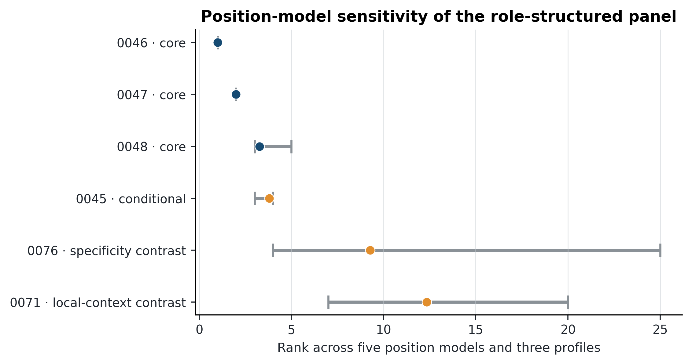
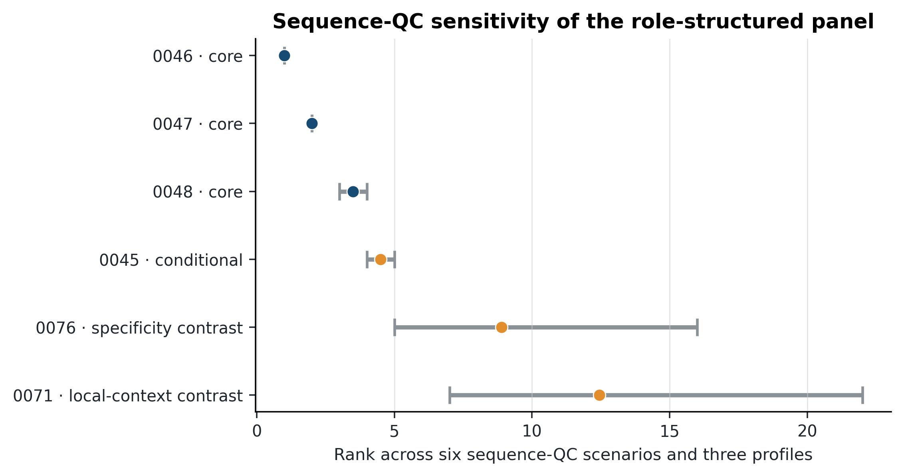
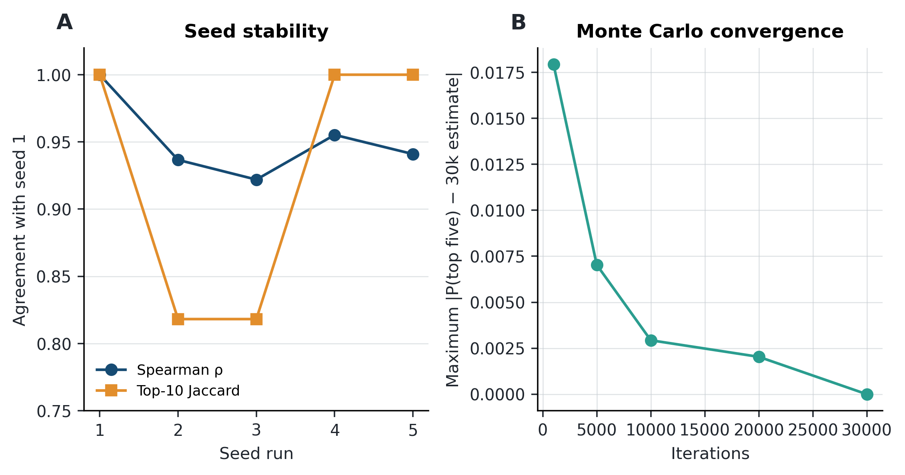
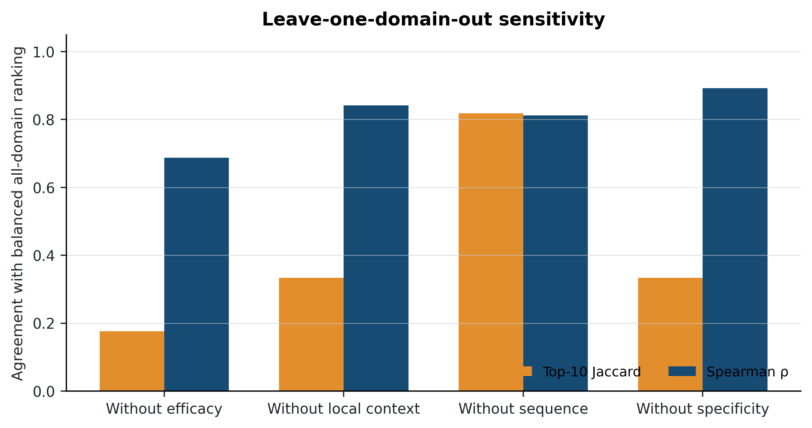

# Supplementary Materials

## An Uncertainty-Aware Multi-Criteria Framework for CRISPRi Guide Prioritisation: A Reproducible *MALAT1*–A549 Case Study

**Deniz Duru Derviş**  
Istanbul Technical University, Faculty of Management, Department of Industrial Engineering, Istanbul, Türkiye

This document contains the analysis settings, provenance and reproducibility audit, additional robustness tables, and eight supplementary figures supporting the main manuscript. Probabilities are conditional rank-acceptability quantities under the stated model and candidate set; they are not probabilities of laboratory repression or empirical safety.

## Supplementary Table S1. Frozen inputs and provenance

| Resource | Version or accession | SHA-256 or pinned identifier | Role in the analysis |
|:---|:---|:---|:---|
| Human primary assembly | GRCh38 primary-assembly FASTA | `b760d18dbb651dd14dfc290083371b3ef3bff122d43a9cefb13ca4ecf38f05ca` | Candidate discovery and whole-genome matching |
| Chromosome 11 sequence | GRCh38 chr11 FASTA | `a395f42c213ff69eb9006fe47e8a77d81888e2c1e4670ce955a1c920b1e086c3` | Locus extraction and sequence checks |
| Gene annotation | GENCODE 50, GRCh38.p14 | `83fba3e9b03f0b8c958f3595c6c350adc55f468abf8b0e47b6d5284cfe13a453` | Transcript and local-context annotation |
| A549 CAGE | FANTOM5 CNhs11275 | Sample accession pinned | Cell-context TSS evidence |
| A549 ATAC-seq | ENCODE ENCSR032RGS | ENCFF899OMR; ENCFF876UEM | Accessibility evidence |
| A549 poly(A)-minus RNA-seq | ENCODE ENCSR000CQC | ENCFF006LPZ; ENCFF957YDR | Expression-context evidence |
| Raw decision matrix | `malat1_a549_raw_decision_matrix_v0_2.tsv` | `3b57bc94fa08825793c7cef2fb9c26806732c5f23ad88f95657b113bcb5acc8a` | Frozen 86-candidate input |
| Provisional panel | `malat1_a549_provisional_validation_panel_v0_1.tsv` | `38163c623db2bda9cf544f31f33004c113416510f85cd7a7399f14f1de024470` | Role-structured validation panel |
| Stojic 2018 guide set | `stojic2018_guides_grch38_corrected.tsv` | `97d0ac61ace628890310c6d3a100161bfdbdf22144eec5e7a6d297475f02ccf1` | Historical locus comparison |
| CRiNCL design guide set | `crincl_malat1_unique_guides_grch38_v2.tsv` | `da35847d9ec42fa22d3a2ce984df6c6ca2eac37e0c0fd10fd2266891d4d00fcc` | Historical locus comparison |

## Supplementary Table S2. Primary stochastic-analysis settings

| Component | Setting | Interpretation |
|:---|:---|:---|
| Candidate set | 86 SpCas9-NGG candidates within ±500 bp of chr11:65,499,045 | Frozen alternative set |
| Preference profiles | Balanced = (0.30, 0.30, 0.15, 0.25); efficacy-focused = (0.45, 0.20, 0.10, 0.25); safety-focused = (0.20, 0.35, 0.15, 0.30) | Domain weights ordered as efficacy context, local context, sequence feasibility, predicted specificity |
| Profile-weight sampling | Dirichlet concentration 60 around each profile anchor | Preference variation within each substantive profile |
| Within-domain splits | Beta(20,20) for efficacy and local-context splits | Uncertain allocation between the two criteria in each paired domain |
| Position model | Trapezoid with uncertain core edges: left triangular(−75,−50,−25), right triangular(250,300,350); TSS shift N(0,2), clipped at ±6 bp | Position and reporting-anchor uncertainty |
| ATAC reliability | Beta(19,1) | Reliability of the binary overlap classification |
| TALAM1 overlap penalty | Triangular(0.10,0.30,0.60) | Local annotation-overlap proxy |
| Nearby-promoter penalty | Triangular(0.40,0.70,0.95) | Local annotation-overlap proxy |
| Sequence rule | 30–70% GC inclusive; no TTTT; maximum homopolymer length 4 | Locked primary feasibility screen |
| Jost uncertainty | Candidate-specific beta distribution; concentration 40 | Uncertainty around predicted CRISPRi specificity |
| Profile simulation | 30,000 iterations per profile; base seed 20260715 | Primary rank-acceptability analysis |
| Global-weight simulation | 50,000 draws with Dirichlet(1,1,1,1) domain weights | Profile-free preference stress test |
| Confidence-factor analogue | 20,000 criterion-uncertainty draws at candidate-specific central weights | Conditional rank-1 and top-five stability |

## Supplementary Table S3. Robustness and reproducibility audit

| Audit | Headline result | Bounded interpretation |
|:---|:---|:---|
| Position-model sensitivity | 0046 rank 1 in all models/profiles; 0047 rank 2; 0048 rank 3–5; 0045 rank 3–4 | Leading core is insensitive to the tested position transforms |
| Sequence-QC sensitivity | 0046 rank 1; 0047 rank 2; 0048 rank 3–4; 0045 rank 4–5 | Leading core is insensitive to tested sequence screens |
| Specificity-model sensitivity | 0046 rank 1; 0047 rank 2–3; 0048 rank 2–4; 0045 rank 3–29 | 0045 is model-conditional; Hsu/MIT and CFD are sensitivity substitutions |
| Leave one domain out | Spearman 0.687 without efficacy; 0.841 without local context; 0.812 without sequence; 0.892 without specificity | Efficacy context is structurally most influential for the full ranking |
| Four-domain Pareto sorting | Eight first-front candidates; panel members 0046 and 0076 on front 1 | Pareto efficiency is four-dimensional and does not imply highest efficacy support |
| OAT uncertainty audit | Mean absolute rank shift: weights 1.489; Jost 0.902; local context 0.643; ATAC 0.295; position 0.273 | Weights are the largest isolated source; OAT is not a variance decomposition |
| Monte Carlo convergence | Maximum absolute top-five difference vs 30,000 = 0.00293 at 10,000 and 0.00203 at 20,000 | Leading-set probabilities are numerically stable at the selected iteration count |
| Five-seed audit | Same leading five in every run; whole-ranking Spearman 0.922–0.955; top-10 Jaccard 0.818–1.000 | Leading set is stable; the entire 86-candidate ranking is not identical |
| Regression validation | All columns in 13 locked scientific TSV outputs matched with maximum numeric difference 0 at tolerance 5 × 10⁻⁸; 22 PNG and 14 PDF figure artifacts passed integrity checks | Reproduces the deposited post-FlashFry calculations only |

## Supplementary Table S4. Central-weight confidence-factor analogue for the leading core

| Profile | Candidate | Original P(rank 1) | Central-weight P(rank 1) | Central-weight P(top five) |
|:---|:---|---:|---:|---:|
| Balanced | 0046 | 0.732 | 0.790 | 1.000 |
| Balanced | 0047 | 0.173 | 0.190 | 0.998 |
| Balanced | 0048 | 0.008 | 0.009 | 0.961 |
| Efficacy-focused | 0046 | 0.789 | 0.794 | 1.000 |
| Efficacy-focused | 0047 | 0.195 | 0.192 | 1.000 |
| Efficacy-focused | 0048 | 0.009 | 0.009 | 0.969 |
| Safety-focused | 0046 | 0.506 | 0.686 | 0.999 |
| Safety-focused | 0047 | 0.110 | 0.156 | 0.990 |
| Safety-focused | 0048 | 0.004 | 0.007 | 0.831 |

The central-weight quantities condition on each candidate's profile-specific central criterion-weight vector and resample criterion uncertainty. They are a study-specific analogue of an SMAA confidence factor, not empirical success probabilities.

## Supplementary Figures

{width=95%}

{width=95%}

{width=95%}

{width=95%}

{width=95%}

{width=95%}

{width=95%}

{width=95%}

## Reproducibility note

The clean run reconstructed the normalised matrix, the three profile simulations, the central weights, the confidence-factor analogue, the extended sensitivity suite, all manuscript and supplementary figures, and the validation reports from the frozen inputs. The validation scope is deliberately bounded: it compares every column in 13 locked scientific TSV outputs, checks candidate-count and leading-order invariants, and verifies the generated figure artifacts. It does not repeat public-data retrieval, reference-genome indexing, FlashFry discovery, or experimental validation.
